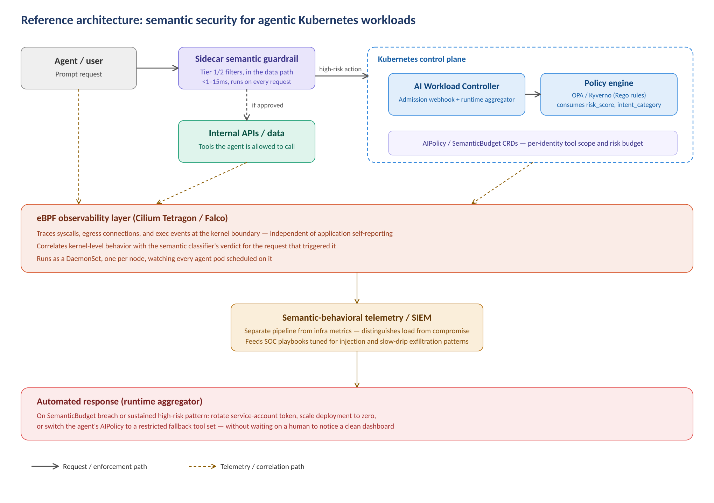

# AI Workload Security for Kubernetes

Kubernetes secures *where code runs* and *what it consumes*. Agentic LLM workloads need something that answers *what the workload is deciding to do* — and nothing upstream does that today. This project is a reference implementation: a sidecar for low-latency semantic filtering, a custom Kubernetes Operator for cluster-wide policy and admission control, and Tetragon/eBPF integration for kernel-level behavioral evidence.

**Status: early-stage reference implementation, not production-hardened.** Issues and PRs welcome — see [CONTRIBUTING.md](CONTRIBUTING.md).

## What this is not

Nothing in this repo is an existing upstream Kubernetes or CNCF capability. `AIPolicy` and `SemanticBudget` are custom CRDs this project defines; the "AI Workload Controller" is a custom Operator you build and run yourself (scaffolded with [Kubebuilder](https://kubebuilder.io)). See [docs/architecture.md](docs/architecture.md) for the full design rationale, including what each component can and can't actually see.

## Architecture



- **Sidecar** (`sidecar/`) — tier-1 regex filtering and a pluggable tier-2 classifier interface, running in-process next to the agent. Every high-risk verdict gets reported to the operator.
- **Operator** (`api/`, `controllers/`, `webhook/`) — reconciles `AIPolicy` and `SemanticBudget`, runs the admission webhook, and aggregates verdict events fleet-wide for budget enforcement and quarantine.
- **Tetragon policy** (`deploy/tetragon/`) — eBPF-based egress/exec tracing for kernel-level ground truth, correlated with (not a replacement for) the sidecar's semantic verdicts.
- **Rego policy** (`policies/rego/`) — policy-as-code that consumes risk scores as first-class input while staying deterministic and testable itself.

Full design writeup, including the reasoning behind each decision and the limits of each component, is in [docs/architecture.md](docs/architecture.md).

## Quick start

Prerequisites: Kubernetes 1.27+, Cilium CNI (for Tetragon), Helm 3, OPA Gatekeeper or Kyverno already enforcing on your target namespaces.

```bash
# 1. Sidecar: build and push your own image, then wire it into your agent
#    Deployment as in deploy/examples/agent-deployment.yaml.
cd sidecar && docker build -t <your-registry>/semantic-guardrail:latest .

# 2. eBPF: install Tetragon and apply the tracing policy.
helm repo add cilium https://helm.cilium.io
helm install tetragon cilium/tetragon -n kube-system
kubectl apply -f deploy/tetragon/agent-egress-baseline.yaml

# 3. Operator: build and deploy the CRDs, controller, and webhook.
docker build -t <your-registry>/ai-workload-controller:latest .
kubectl apply -f config/crd/bases/
kubectl apply -f config/rbac/role.yaml
helm install ai-workload-controller charts/ai-workload-controller -n ai-security --create-namespace

# 4. Define a policy for your agent identity.
kubectl apply -f config/samples/aipolicy_sample.yaml

# 5. Register the admission webhook and label your namespace.
kubectl label namespace ai-agents ai-workload=true
kubectl apply -f config/webhook/manifests.yaml
```

See [docs/deployment-guide.md](docs/deployment-guide.md) for the full walkthrough with verification steps at each stage.

## Repo layout

```
api/v1alpha1/        AIPolicy and SemanticBudget CRD Go types
controllers/          Reconcilers + runtime aggregator (fleet-wide event correlation)
webhook/v1alpha1/     Admission webhook: validates declared tool scope against AIPolicy
config/               CRD YAMLs, RBAC, webhook config, sample resources
sidecar/              Semantic guardrail sidecar (tier-1/tier-2 filtering)
deploy/               Tetragon policy + example agent manifests
policies/rego/        Policy-as-code examples and tests
charts/               Helm chart for the operator
docs/                 Architecture writeup and deployment guide
```

## License

Apache 2.0 — see [LICENSE](LICENSE).
